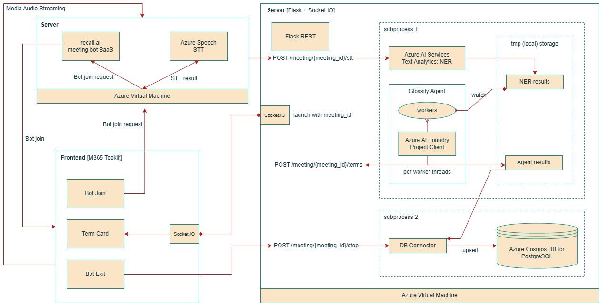

# Glossify: real-time explanations of domain-specific terms
## MS 2025 Summer Interns Project: this repo contains explanation of the BE


> Glossify's backend runs on Azure VM, served by Gunicorn (gevent-websocket worker) for Flask + Socket.IO service, bound on 127.0.0.1:5000 behind a reverse proxy.
```bash
gunicorn -k geventwebsocket.gunicorn.workers.GeventWebSocketWorker -w 1 -b 127.0.0.1:5000 server:app
```

---

# 1) Runtime 구성

* **프로세스**: Azure VM에서 Python 프로세스 하나가 Flask+Socket.IO 서버(`server.py`)를 띄움.

  * 운영 시 권장 커맨드:

    ```
    gunicorn -k geventwebsocket.gunicorn.workers.GeventWebSocketWorker -w 1 -b 127.0.0.1:5000 server:app
    ```

    * `-k geventwebsocket...` → WebSocket 지원.
    * `-w 1` → **단일 워커**. (중요) 이 앱은 워커마다 내부 백그라운드 스레드와 파일 감시자가 뜨므로, 워커를 늘리면 **중복 처리**가 발생할 수 있음. 스케일링 필요 시 **프로세스 외부**로 워커/워처를 분리하는 아키텍처가 필요.
* **동시성 모델**: Flask-SocketIO가 `gevent` 모드로 동작 (기본값). 앱 내부 비동기 I/O + 자체적인 **백그라운드 스레드**(파이썬 `threading`) 병행.
* **디렉터리/로그**:

  * `stt_results/…`: STT 원문 로그 (`append_stt_line`)
  * `ner_results/ner_entities_*.csv`: NER 결과 CSV (`append_ner_rows`)
  * `agent_results/glossify_*.csv`: 에이전트가 생성한 용어 설명 CSV
  * `logs/glossify_agent.log`: 에이전트 실행 로그(회전 로그)

---

# 2) 요청–응답 & 데이터 파이프라인

## A. 실시간 파이프라인 (STT → NER → Agent → WS 브로드캐스트)


핵심 포인트

* **`/stt`** 들어오면 **무조건 ACK**를 바로 돌려준다(파이프라인 끊기지 않게). NER 실패해도 STT 측엔 에러를 숨김.
* NER 결과는 **CSV 파일에 append**. 별도의 프로세스/스레드가 아니라 **같은 서버 프로세스** 안에서 `glossify_agent.py`가 watchdog으로 이 CSV를 **실시간 tail**.
* 에이전트 워커들은 **Azure AI Foundry Agent**에 병렬 질의 → 결과 텍스트에서 `domain`, `body`를 파싱하고,

  1. **서버 REST**(`/meeting/<mid>/terms`)로 단건 POST하여
  2. 서버가 해당 미팅 **WebSocket room**에 `terms` 이벤트로 브로드캐스트.
  3. 동시에 **에이전트 결과 CSV**(`agent_results/glossify_*.csv`)에도 저장. (Cosmos 업서트용)

## B. 세션 종료 파이프라인 (Stop → Cosmos upsert)


---

# 3) 주요 모듈별 역할

## 3.1 `server.py` (Flask + Socket.IO 진입점)

* **Socket.IO 초기화**

  * `async_mode`: 환경변수 `SOCKETIO_ASYNC_MODE`가 `eventlet/gevent/...`이면 해당 패키지 존재 시 채택, 아니면 마지막에 기본 `"gevent"`.
  * 운영 커맨드가 gevent-websocket 워커를 쓰므로 기본값과 일치.

* **WS 룸 모델**

  * 클라이언트는 `join` 이벤트로 `{meeting_id}`를 보냄 → 서버는 `join_room(meeting_id)` 하고 `"ack"` 반환.
  * 이후 서버는 **항상 룸 단위**로 이벤트 송신:

    * 용어 설명: `"terms"`
    * 업서트 완료/오류: `"cosmos_upsert_done"`, `"cosmos_upsert_error"`

* **REST 엔드포인트**

  * `GET /` / `GET /health`: 헬스체크/버전 간단 응답.
  * `POST /meeting/<mid>/start`
    meeting별 \*\*에이전트 서비스(AgentService)\*\*를 1개만 띄움. (내부 `_AGENTS` dict로 보장)
  * `POST /meeting/<mid>/stt`

    * STT 텍스트 수신 → (옵션) partial 스킵 → **중복 최종문 필터링**(`LAST_FINAL[meeting]` LRU 32개) → `analyze_ner` 호출 → NER CSV append.
    * **항상 ACK** (`{"status":"ok"}`)을 빠르게 반환.
  * `POST /meeting/<mid>/terms`

    * (에이전트 또는 외부 프로세스가) 단건/배열 형태로 용어 설명을 보냄.
    * 유효성 보정 후 **해당 미팅 룸으로 WS 브로드캐스트**.
  * `POST /meeting/<mid>/stop`

    * 업서트 작업을 **백그라운드 스레드**로 실행.
    * 즉시 `{"status":"accepted"}` 응답 → 완료/에러는 WS 이벤트로 통지.
  * `GET /meeting/<mid>/stop/status`

    * 최근 업서트 상태 조회(폴링용).

* **스레딩/락**

  * `_AGENTS_LOCK`: meeting별 에이전트 인스턴스 생성/조회 동기화.
  * `_STOP_LOCK`: 업서트 진행 상태 dict 보호.
  * WS 브로드캐스트는 `sio.emit(..., to=meeting_id)`.

* **기타**

  * `sio.run(app, use_reloader=False)` 사용 → 개발 중 중복 기동 방지.
  * CORS는 `*` 허용(프론트/Teams 사이드패널 등에서 호출 용이).

## 3.2 `ner_core.py` (NER 호출 + 로깅)

* **Azure Language Service (NER)**

  * `POST {endpoint}/language/:analyze-text?api-version=2024-11-01`
  * `analyze_ner(text)` → `entities, grouped` 반환.
* **로그 경로**

  * `stt_results/stt_transcripts_*.txt` : `append_stt_line()`
  * `ner_results/ner_entities_*.csv` or `.txt` : `append_ner_rows()`
  * 파일 동시 접근에 대비해 **파일 단위 Lock**(`STT_LOG_LOCK`, `NER_LOG_LOCK`) 사용.
* **환경변수**

  * `LANGUAGE_KEY`, `LANGUAGE_ENDPOINT` 필수. 없으면 초기 import 시점에 예외.

## 3.3 `glossify_agent.py` (CSV tail → Agent 호출 → 결과 POST/저장)

* **시작**: `start_agent_in_background(meeting_id)`가 호출되면

  * `AgentService` 인스턴스 생성 → `start()`:

    * **워커 스레드 N개**(기본 5) 기동
    * \*\*watchdog(파일 감시자)\*\*로 `ner_results/ner_entities_*.csv` tail 시작
    * **메트릭 루프**(2초마다 상태 로그) 시작
* **CSV tail 로직**

  * 최신 파일 자동 스위칭(newest\_csv) + CSV 레코드 완결성 보장(따옴표/줄바꿈 포함 행 읽기)
  * 레코드 파싱 → **필터링**:

    * 허용 카테고리 (`ALLOWED_CATS`)
    * confidence ≥ 0.5
    * 토큰 수 규칙(약어/대문자/확신도 높은 단어는 예외 허용)
    * 동일 timestamp 내 **중복 제거**(카테고리, 엔티티, 소스텍스트 기준)
  * 패스하면 **작업 큐**(bounded)로 투입. 큐가 가득 차면 **overflow deque**에 보관 후 재주입.
* **에이전트 호출 (워커)**

  * 자격증명: `DefaultAzureCredential` (Managed Identity/Env/CLI 등)
  * **기존 Agent만 사용**:

    * `AGENT_ID`를 **환경변수** 또는 `foundry_agent.json`(프로젝트 엔드포인트/디플로이 정보 포함)에서 로드.
    * 없거나 무효이면 **절대 새로 생성하지 않고 즉시 오류**. (운영 안정성 목적)
  * **스레드별 Foundry Thread를 1개씩 생성/재사용** → 병렬 처리시 컨버세이션 상태 분리.
  * 재시도/백오프/타임아웃:

    * 1회 run 타임아웃(`AGENT_RUN_TIMEOUT_SEC`), 전체 재시도 제한(`AGENT_TOTAL_TIMEOUT_SEC`, `AGENT_RETRY_MAX`).
* **응답 파싱 & 전송**

  * 응답 텍스트에서 `domain, body` 추출(도메인 프리픽스 정규식).
  * 맨 끝 문장이 “맥락 연결” 같은 안내문이면 저장용으로 제거(문장 경계 정규식 + 접두 패턴).
  * **서버로 POST** `/meeting/<mid>/terms` (connect/read 타임아웃 별도 설정).
  * 동시에 **CSV append**(`agent_results/glossify_*.csv`).
* **락/상태**

  * 결과 CSV append에 `_write_lock`.
  * timestamp 그룹 중복제거에 `_ts_lock`.
  * 에이전트 상태 파일 IO에 `AGENT_STATE_LOCK`.

## 3.4 `cosmos_terms.py` (Cosmos for PostgreSQL upsert)

* **커넥션 풀**: `psycopg2.pool.SimpleConnectionPool(min=1, max=10)`

  * `start()`에서 풀 생성, `ensure_table_and_indexes()` 1회 실행.
* **스키마**

  ```sql
  CREATE TABLE IF NOT EXISTS term (
      termid      uuid        NOT NULL,
      term        text        NOT NULL,
      explanation text        NOT NULL,
      domain      text        NOT NULL,
      PRIMARY KEY (termid, domain)
  );
  CREATE INDEX IF NOT EXISTS idx_term_term_domain ON term(term, domain);
  ```

  * (옵션) Citus 환경이면 `create_distributed_table('term','termid')` 시도(권한 없으면 무시).
* **업서트 알고리즘**

  * 에이전트 CSV(`agent_results/glossify_*.csv`)의 **마지막 발생값만** 반영 (동일 `(termid, domain)` 키는 최신 행이 승리).
  * `execute_values`로 벌크 upsert.
  * `termid`는 `uuid5(NAMESPACE_URL, "glossify-term:{normalized(term)}")`로 **용어 정규화 후 안정적 키** 생성 → 용어 철자만 같으면 동일 키.

---

# 4) 동시성/스레딩 핵심

* **서버(Flask-SocketIO)**: gevent 이벤트 루프 + 함수 내부에서 Python 스레드도 사용(업서트 워커 등).
* **에이전트(AgentService)**:

  * **워커 스레드 N개**(기본 5)
  * **watchdog** 파일 감시자 스레드 1개
  * **메트릭** 스레드 1개
* **락 사용 지점**:

  * 로그 파일 append (별도 Lock)
  * 타임스탬프 내 중복 제거 세트
  * 에이전트 상태 파일
  * 서버 측 meeting→Agent 인스턴스 맵
  * stop 상태 맵
* **백프레셔**: 큐 최대치(`MAX_QUEUE`) 도달 시 overflow deque에 임시 저장, 큐가 비면 재주입.

---

# 5) 운영 관점 체크리스트

1. **AGENT\_ID 준비**

   * `foundry_agent.json` 또는 `AGENT_ID` 환경변수. (없으면 워커가 즉시 실패)
2. **자격증명**

   * VM에서 `DefaultAzureCredential`이 통과하도록 Managed Identity or Service Principal 설정.
3. **단일 워커 보장**

   * gunicorn `-w 1` 유지. (멀티워커면 watchdog/큐가 중복 동작)
4. **파일 권한/경로**

   * `stt_results`, `ner_results`, `agent_results`, `logs` 디렉토리 생성권한 확인.
5. **DB 접속성**

   * Cosmos for PostgreSQL의 5432 인바운드/아웃바운드, SSL required.
6. **CORS/보안**

   * 현재 CORS `*` 개방. 배포 환경에 맞게 조정 고려.
7. **헬스/테스트**

   * `GET /health`, `GET /`로 확인.
   * 샘플 STT:

     ```bash
     curl -X POST http://<host>:5000/meeting/demo123/stt \
       -H "Content-Type: application/json" \
       -d '{"text":"오늘 CPK 지표가 불안정합니다.","is_final":true}'
     ```
   * 샘플 terms (에이전트 우회 테스트):

     ```bash
     curl -X POST http://<host>:5000/meeting/demo123/terms \
       -H "Content-Type: application/json" \
       -d '{"timestamp":"2025-09-08T00:00:00Z","entity":"CPK","domain":"Manufacturing","body":"공정능력지수(Cpk)는..."}'
     ```
   * 업서트:

     ```bash
     curl -X POST http://<host>:5000/meeting/demo123/stop
     ```

---

# FAQ

* **왜 단일 gunicorn 워커?**
  내부에 파일 감시/워커 스레드가 붙은 **상태 보유형** 서비스라서. 멀티 워커면 각자 tail/큐/업서트를 중복 수행 → 레이스/중복전송/이중업서트 위험.

* **Socket.IO 모드는 왜 gevent?**
  운영 커맨드가 gevent-websocket 워커를 사용하고, 기본 async\_mode도 gevent로 설정되어 **WS 성능/호환**을 맞춘 상태.

* **STT partial을 처리할까?**
  `RUN_NER_ON_PARTIAL`=0(기본)면 partial은 **로그만** 하고 NER 생략. 1로 바꾸면 partial도 NER.

* **에이전트가 새로 안 만들어지는 이유?**
  운영 일관성/권한 문제 방지를 위해 **기존 Agent만 사용**하도록 설계. `AGENT_ID`를 반드시 제공해야 한다.

* **결과 텍스트의 ‘문맥 문장’ 제거는 왜?**
  프론트 표시와 Cosmos 저장 시 **핵심 정의**만 남기고, “이 맥락에서…” 같은 trailing 문장은 제거해 중복/군더더기를 최소화.

* **Cosmos 업서트 시 중복 키 기준은?**
  `(termid, domain)` 복합키. `termid`는 용어 정규화(NFKC, lower) 후 UUID5로 생성 → **안정적인 동일 키**.
